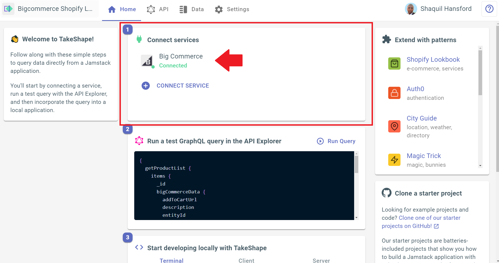
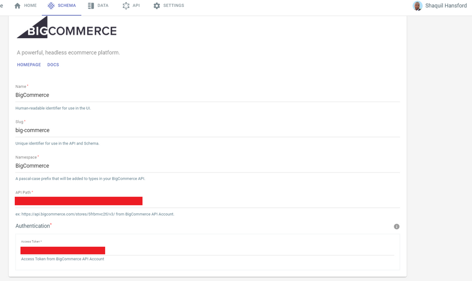
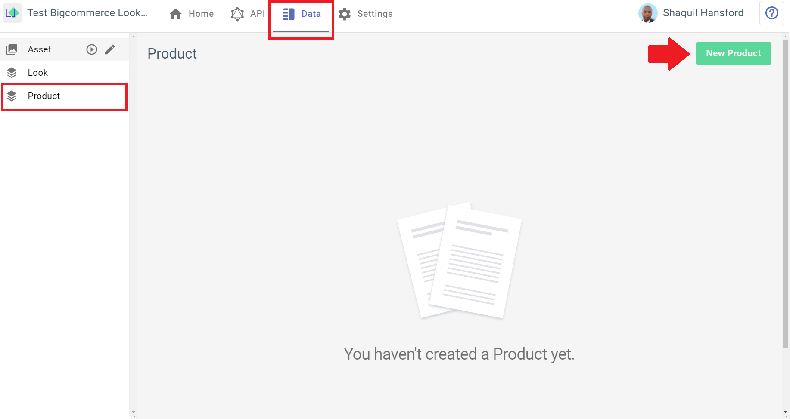
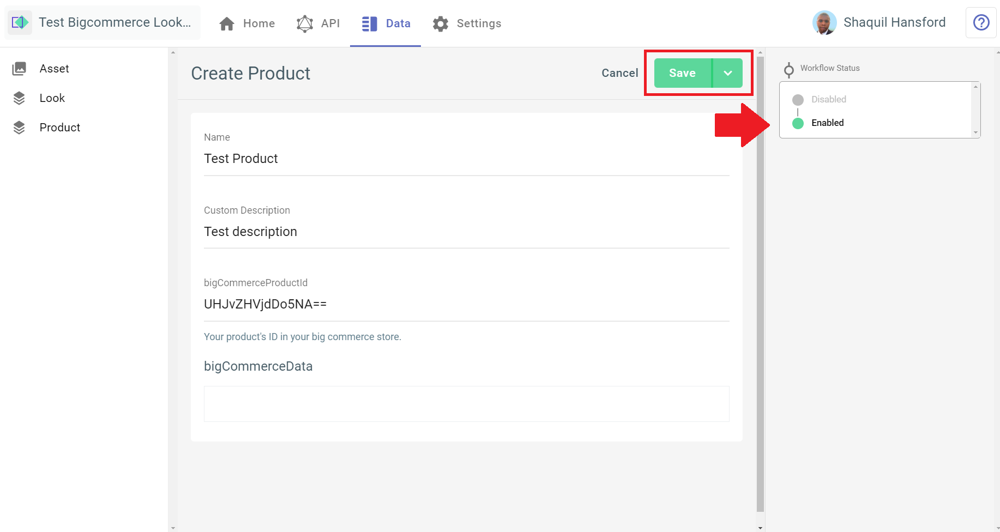
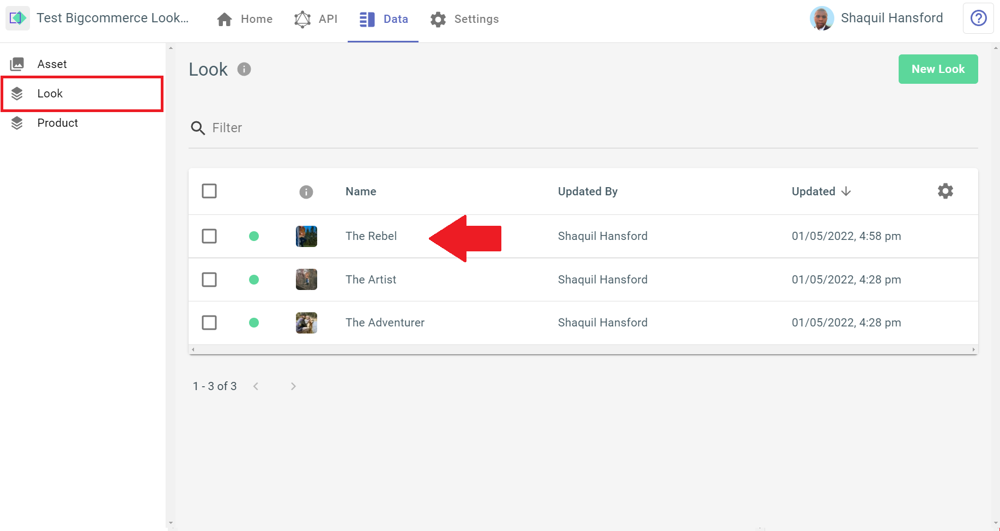
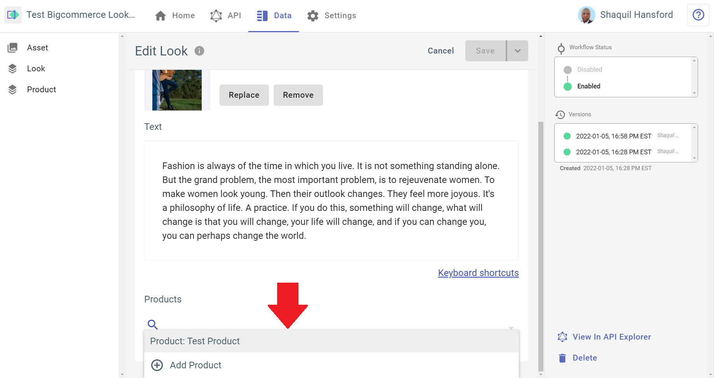

# TakeShape BigCommerce and NextJS Starter

This is a starter project that demonstrates using TakeShape to extend your BigCommerce products and displaying them in NextJS. Follow along with this Readme to get started.

## Instructions to run

1. Create a TakeShape project with the pattern in this repo. The button below will deploy the project:

- 

2. In the Home tab of your project dashboard, click on BigCommerce in the Connect Services section.

2. Configure your BigCommerce connection by giving it a name, slug and namespace, as well as adding the API path and access token from your BigCommerce site. If you don't know where to find that information, you can [click here](https://app.takeshape.io/docs/services/providers/bigcommerce/#connecting-bigcommerce-to-your-takeshape-project) to read our guide on connecting a BigCommerce site to your TakeShape project.

3. Once your site is connected, navigate to the Data tab and select the Product shape in the shape list. Click the New Product button, and add a product with a valid product ID from your BigCommerce store. Be sure to enable it in the panel on the right as shown in the image below. When you're done, hit the Save button near the top-right.

3. Now connect your product to a look. This project comes with three pre-created looks for your convenience. Select which one you'd like to attach your product to, then scroll to the bottom of the Edit Look panel to the Products section. Click on the search bar, and search for your product. Select it, then hit the Save button near the top-right. Now you're ready to fetch your looks from your TakeShape project's API.

4. To use your TakeShape project's API in this NextJS repo, you'll need an API key. You can [follow our guide](https://app.takeshape.io/docs/api/api-keys) to use the TakeShape UI to create a read-only API key.

5. You'll also need your TakeShape project's API endpoint to make API calls from your code. Find your API endpoint by navigating to your project in the TakeShape web client and clicking on the Home tab. Scroll down, and you'll see your API Endpoint in the `Useful Snippets` section on the bottom left. Refer to the image below:

4. In the terminal on your local machine, clone this repo with `git clone https://github.com/takeshape/takeshape-starter-bigcommerce-nextjs`

5. Open the project in your favorite IDE or change directories into it with your terminal.

6. Rename `.env.example` to `.env`

7. Open `.env` in your favorite text editor and add your TakeShape API key and API endpoint.

8. Run `npm install` to install the dependencies.

9. Run `npm run build`, then `npm run start` in your terminal to build and serve the project locally.

10. The project will be running on http://localhost:3000

## Learn More

To learn more about Next.js, take a look at the following resources:

- [Next.js Documentation](https://nextjs.org/docs) - learn about Next.js features and API.
- [Learn Next.js](https://nextjs.org/learn) - an interactive Next.js tutorial.

You can check out [the Next.js GitHub repository](https://github.com/vercel/next.js/) - your feedback and contributions are welcome!

## Deploy on Vercel

The easiest way to deploy your Next.js app is to use the [Vercel Platform](https://vercel.com/new?utm_medium=default-template&filter=next.js&utm_source=create-next-app&utm_campaign=create-next-app-readme) from the creators of Next.js.

Check out the [Next.js deployment documentation](https://nextjs.org/docs/deployment) for more details.
